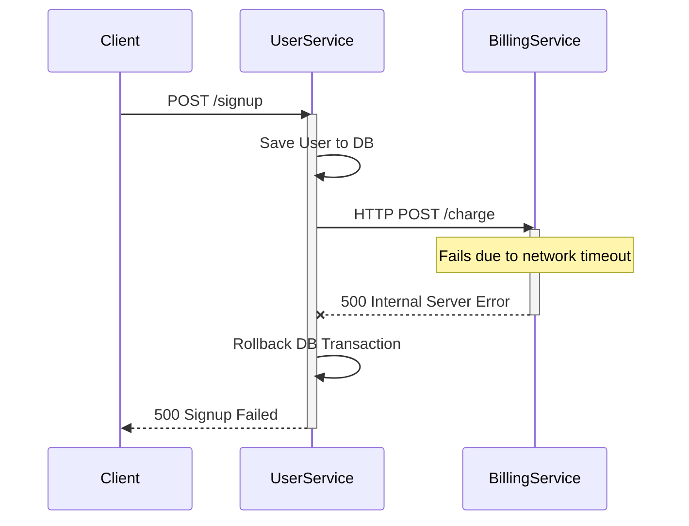
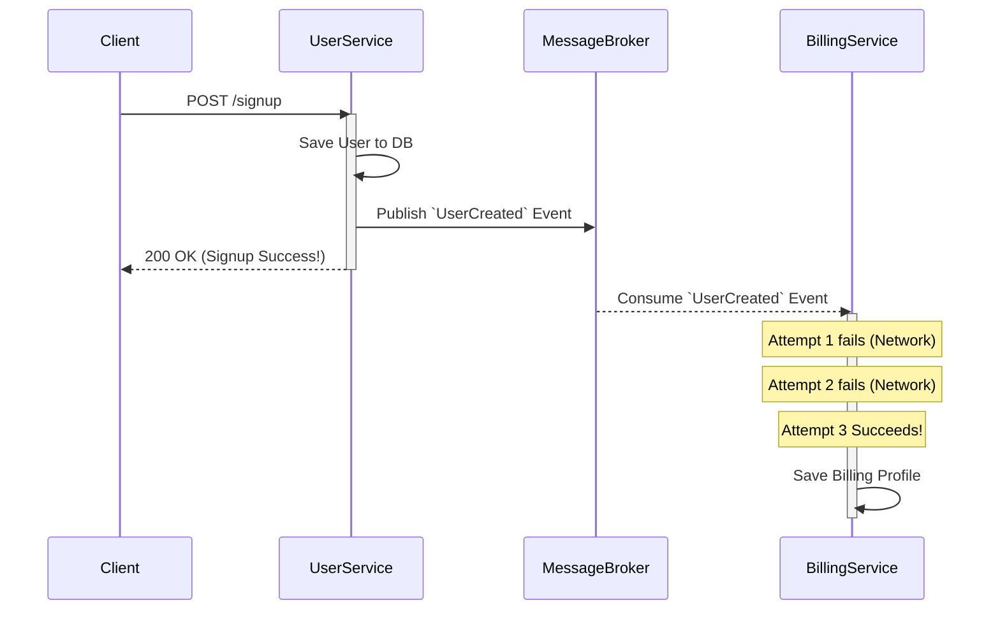

# Architecture Diagrams

## Problem Architecture (Synchronous)

```mermaid
sequenceDiagram
    participant Client
    participant UserService
    participant BillingService
    
    Client->>UserService: POST /signup
    activate UserService
    UserService->>UserService: Save User to DB
    UserService->>BillingService: HTTP POST /charge
    activate BillingService
    Note over BillingService: Fails due to network timeout
    BillingService--xUserService: 500 Internal Server Error
    deactivate BillingService
    UserService->>UserService: Rollback DB Transaction
    UserService-->>Client: 500 Signup Failed
    deactivate UserService
```

## Solution Architecture (Eventual Consistency)

```mermaid
sequenceDiagram
    participant Client
    participant UserService
    participant MessageBroker
    participant BillingService
    
    Client->>UserService: POST /signup
    activate UserService
    UserService->>UserService: Save User to DB
    UserService->>MessageBroker: Publish `UserCreated` Event
    UserService-->>Client: 200 OK (Signup Success!)
    deactivate UserService
    
    MessageBroker-->>BillingService: Consume `UserCreated` Event
    activate BillingService
    Note over BillingService: Attempt 1 fails (Network)
    Note over BillingService: Attempt 2 fails (Network)
    Note over BillingService: Attempt 3 Succeeds!
    BillingService->>BillingService: Save Billing Profile
    deactivate BillingService
```
