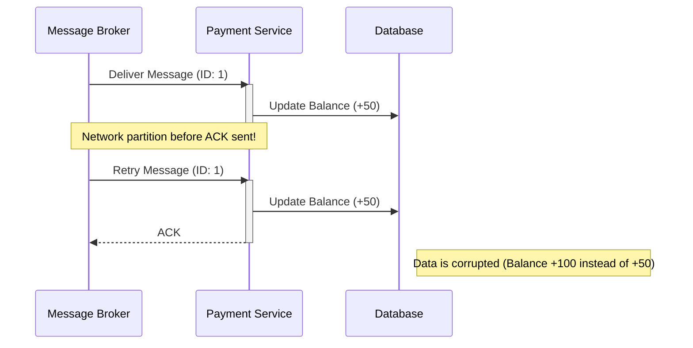
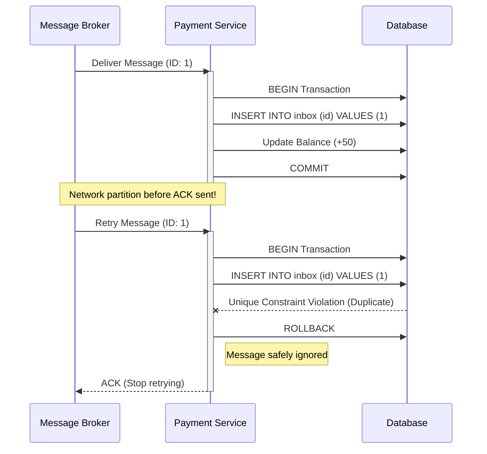

# Architecture Diagrams

## Problem Architecture (Duplicate Processing)

```mermaid
sequenceDiagram
    participant Broker as Message Broker
    participant Service as Payment Service
    participant DB as Database
    
    Broker->>Service: Deliver Message (ID: 1)
    activate Service
    Service->>DB: Update Balance (+50)
    Note over Broker, Service: Network partition before ACK sent!
    deactivate Service
    
    Broker->>Service: Retry Message (ID: 1)
    activate Service
    Service->>DB: Update Balance (+50)
    Service-->>Broker: ACK
    deactivate Service
    Note right of DB: Data is corrupted (Balance +100 instead of +50)
```

## Solution Architecture (Inbox Idempotency)

```mermaid
sequenceDiagram
    participant Broker as Message Broker
    participant Service as Payment Service
    participant DB as Database
    
    Broker->>Service: Deliver Message (ID: 1)
    activate Service
    Service->>DB: BEGIN Transaction
    Service->>DB: INSERT INTO inbox (id) VALUES (1)
    Service->>DB: Update Balance (+50)
    Service->>DB: COMMIT
    Note over Broker, Service: Network partition before ACK sent!
    deactivate Service
    
    Broker->>Service: Retry Message (ID: 1)
    activate Service
    Service->>DB: BEGIN Transaction
    Service->>DB: INSERT INTO inbox (id) VALUES (1)
    DB--xService: Unique Constraint Violation (Duplicate)
    Service->>DB: ROLLBACK
    Note right of Service: Message safely ignored
    Service-->>Broker: ACK (Stop retrying)
    deactivate Service
```
