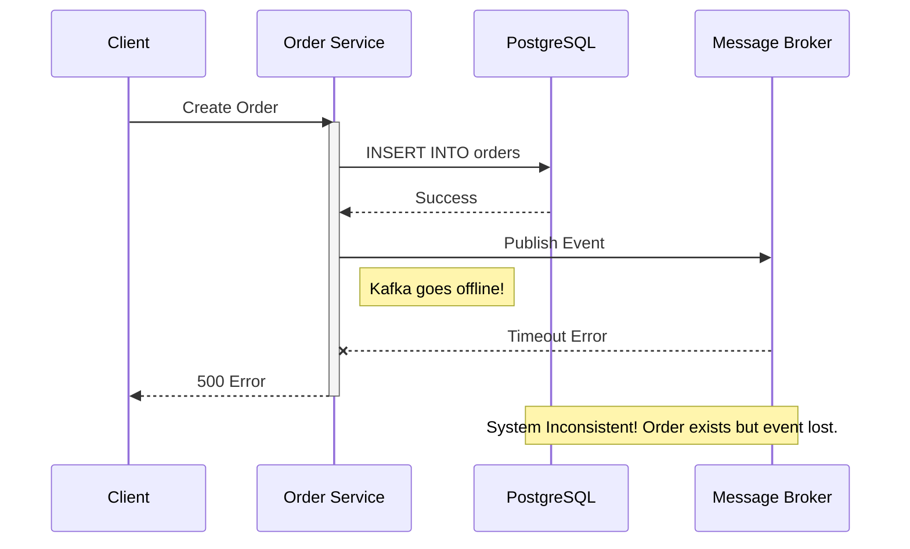
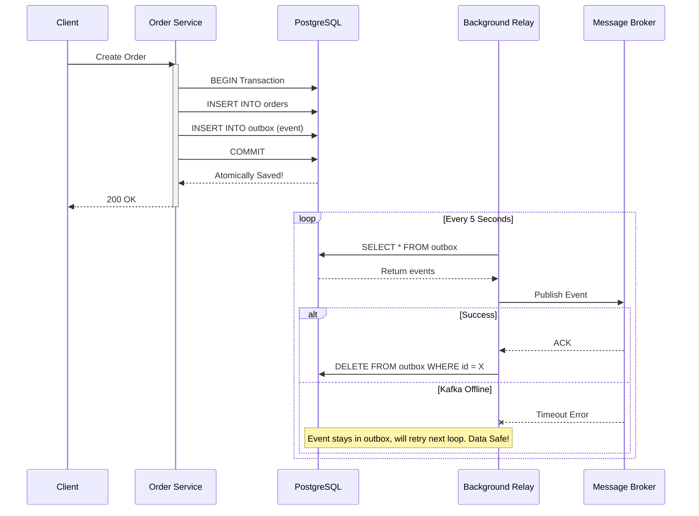

# Architecture Diagrams

## Problem Architecture (The Dual Write)

```mermaid
sequenceDiagram
    participant Client
    participant Service as Order Service
    participant DB as PostgreSQL
    participant Kafka as Message Broker
    
    Client->>Service: Create Order
    activate Service
    Service->>DB: INSERT INTO orders
    DB-->>Service: Success
    
    Service->>Kafka: Publish Event
    Note right of Service: Kafka goes offline!
    Kafka--xService: Timeout Error
    
    Service-->>Client: 500 Error
    deactivate Service
    Note over DB, Kafka: System Inconsistent! Order exists but event lost.
```

## Solution Architecture (Transactional Outbox)

```mermaid
sequenceDiagram
    participant Client
    participant Service as Order Service
    participant DB as PostgreSQL
    participant Relay as Background Relay
    participant Kafka as Message Broker
    
    Client->>Service: Create Order
    activate Service
    Service->>DB: BEGIN Transaction
    Service->>DB: INSERT INTO orders
    Service->>DB: INSERT INTO outbox (event)
    Service->>DB: COMMIT
    DB-->>Service: Atomically Saved!
    Service-->>Client: 200 OK
    deactivate Service
    
    loop Every 5 Seconds
        Relay->>DB: SELECT * FROM outbox
        DB-->>Relay: Return events
        Relay->>Kafka: Publish Event
        alt Success
            Kafka-->>Relay: ACK
            Relay->>DB: DELETE FROM outbox WHERE id = X
        else Kafka Offline
            Kafka--xRelay: Timeout Error
            Note over Relay, DB: Event stays in outbox, will retry next loop. Data Safe!
        end
    end
```
