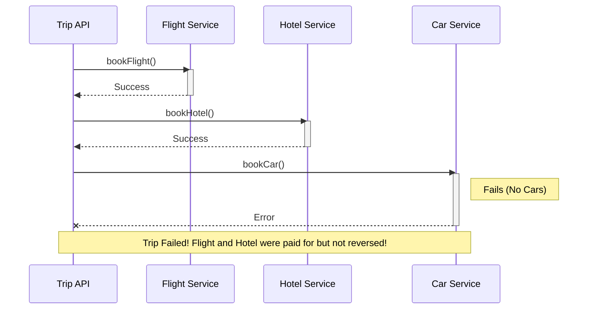
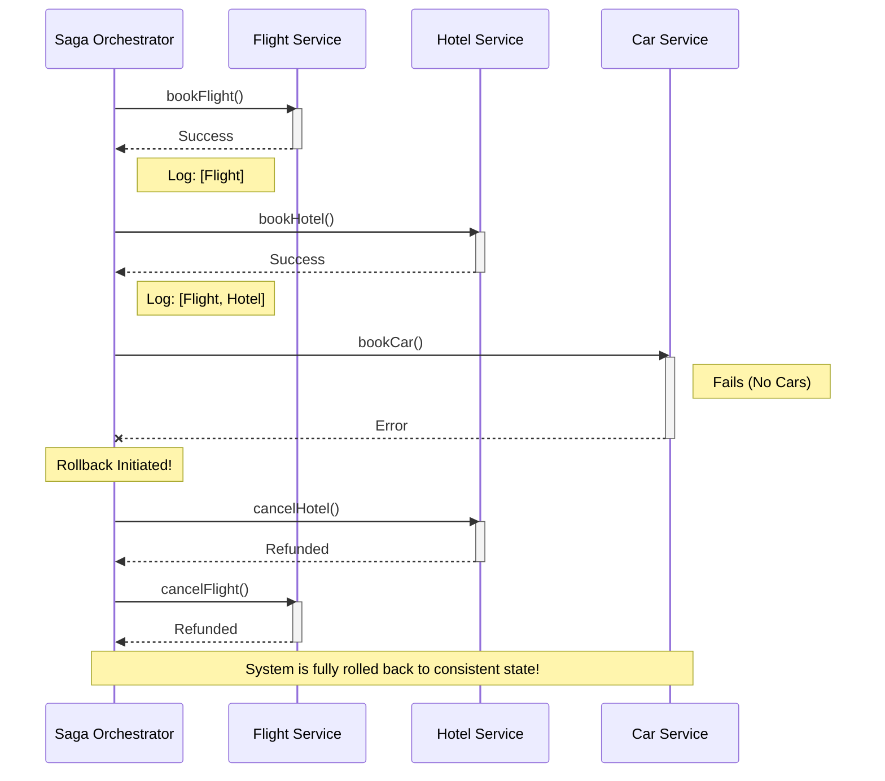

# Architecture Diagrams

## Problem Architecture (No Rollback)

```mermaid
sequenceDiagram
    participant API as Trip API
    participant Flight as Flight Service
    participant Hotel as Hotel Service
    participant Car as Car Service
    
    API->>Flight: bookFlight()
    activate Flight
    Flight-->>API: Success
    deactivate Flight
    
    API->>Hotel: bookHotel()
    activate Hotel
    Hotel-->>API: Success
    deactivate Hotel
    
    API->>Car: bookCar()
    activate Car
    Note right of Car: Fails (No Cars)
    Car--xAPI: Error
    deactivate Car
    
    Note over API, Car: Trip Failed! Flight and Hotel were paid for but not reversed!
```

## Solution Architecture (Saga Orchestration)

```mermaid
sequenceDiagram
    participant Orch as Saga Orchestrator
    participant Flight as Flight Service
    participant Hotel as Hotel Service
    participant Car as Car Service
    
    Orch->>Flight: bookFlight()
    activate Flight
    Flight-->>Orch: Success
    deactivate Flight
    Note right of Orch: Log: [Flight]
    
    Orch->>Hotel: bookHotel()
    activate Hotel
    Hotel-->>Orch: Success
    deactivate Hotel
    Note right of Orch: Log: [Flight, Hotel]
    
    Orch->>Car: bookCar()
    activate Car
    Note right of Car: Fails (No Cars)
    Car--xOrch: Error
    deactivate Car
    
    Note over Orch: Rollback Initiated!
    
    Orch->>Hotel: cancelHotel()
    activate Hotel
    Hotel-->>Orch: Refunded
    deactivate Hotel
    
    Orch->>Flight: cancelFlight()
    activate Flight
    Flight-->>Orch: Refunded
    deactivate Flight
    
    Note over Orch, Car: System is fully rolled back to consistent state!
```
