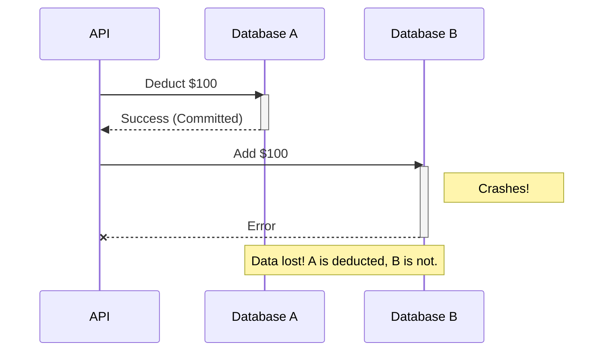
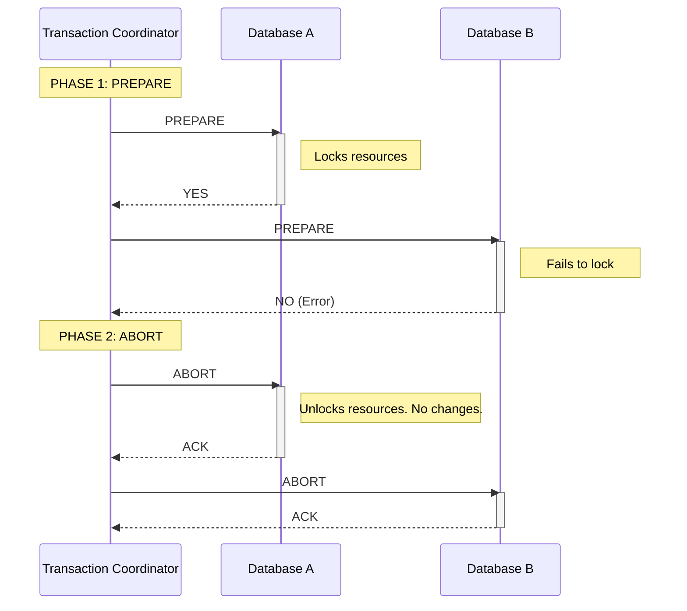

# Architecture Diagrams

## Problem Architecture (No Coordinator)

```mermaid
sequenceDiagram
    participant API
    participant BankA as Database A
    participant BankB as Database B
    
    API->>BankA: Deduct $100
    activate BankA
    BankA-->>API: Success (Committed)
    deactivate BankA
    
    API->>BankB: Add $100
    activate BankB
    Note right of BankB: Crashes!
    BankB--xAPI: Error
    deactivate BankB
    
    Note over BankA, BankB: Data lost! A is deducted, B is not.
```

## Solution Architecture (2PC Protocol)

```mermaid
sequenceDiagram
    participant Coord as Transaction Coordinator
    participant BankA as Database A
    participant BankB as Database B
    
    Note over Coord: PHASE 1: PREPARE
    Coord->>BankA: PREPARE
    activate BankA
    Note right of BankA: Locks resources
    BankA-->>Coord: YES
    deactivate BankA
    
    Coord->>BankB: PREPARE
    activate BankB
    Note right of BankB: Fails to lock
    BankB-->>Coord: NO (Error)
    deactivate BankB
    
    Note over Coord: PHASE 2: ABORT
    Coord->>BankA: ABORT
    activate BankA
    Note right of BankA: Unlocks resources. No changes.
    BankA-->>Coord: ACK
    deactivate BankA
    
    Coord->>BankB: ABORT
    activate BankB
    BankB-->>Coord: ACK
    deactivate BankB
```
