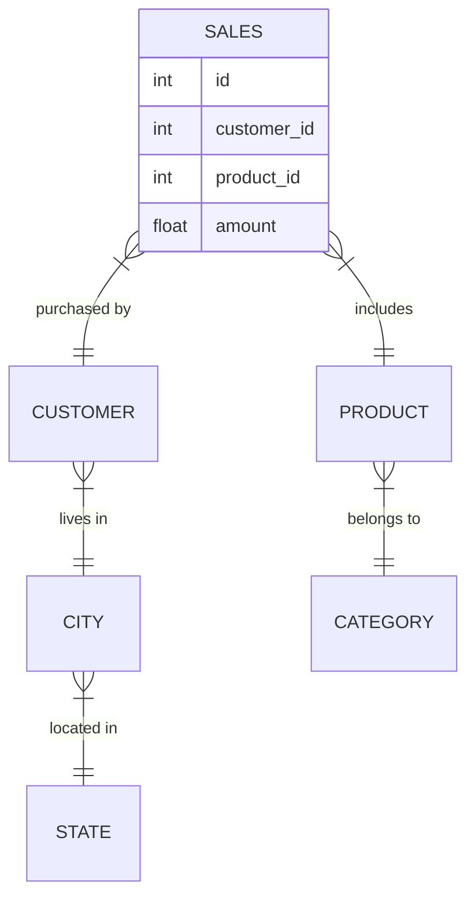
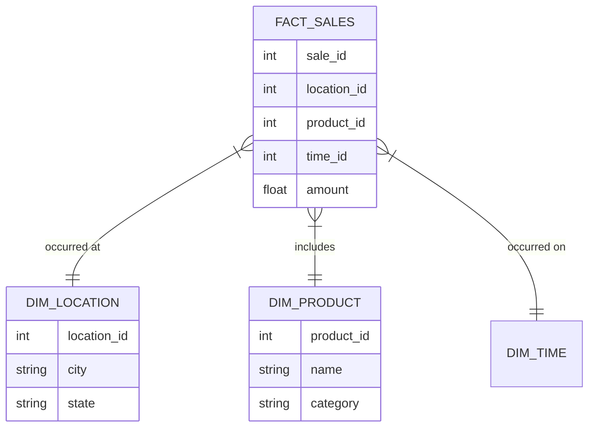

# Architecture Diagrams

## Problem Architecture (Highly Normalized OLTP)

*Notice how deep the tree goes. A query requires traversing 5 different tables.*

## Solution Architecture (Star Schema OLAP)

*Notice the star shape. The central FACT table is exactly one hop away from any descriptive DIMENSION.*
