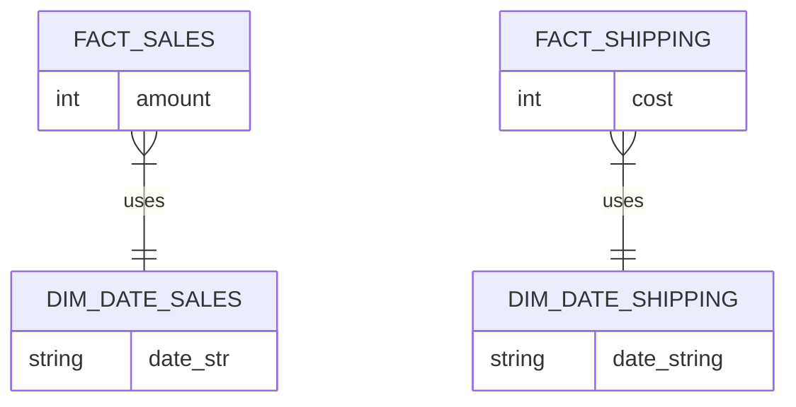
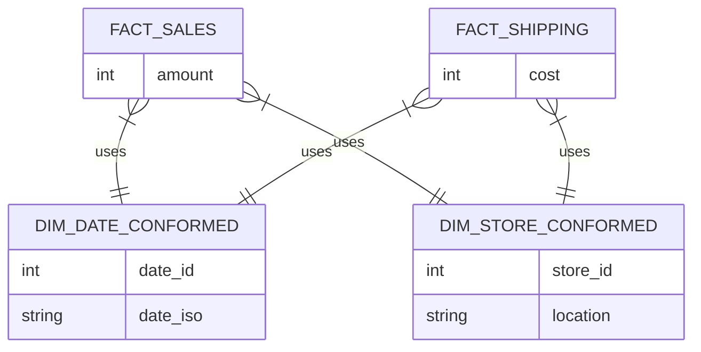

# Architecture Diagrams

## Problem Architecture (Isolated Data Silos)

*Because the dimension tables are isolated, you cannot write a SQL JOIN between FACT_SALES and FACT_SHIPPING.*

## Solution Architecture (Galaxy Schema)

*Notice how the Dimensions act as bridges between the two Fact tables. A single query can now group both Sales and Shipping by Date or Store.*
