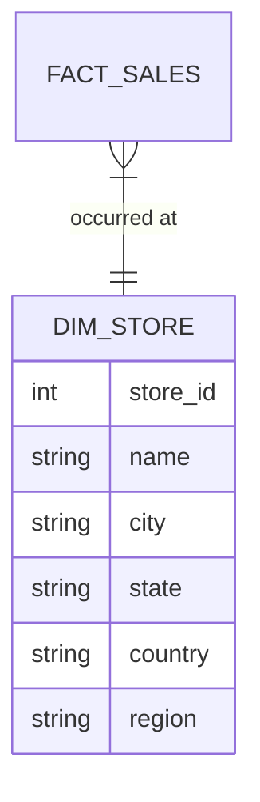
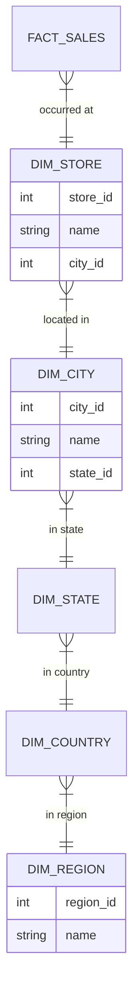

# Architecture Diagrams

## Problem Architecture (Star Schema Bloat)

*In a Star Schema, `DIM_STORE` is flattened. Modifying a region requires updating every single store row in that region.*

## Solution Architecture (Snowflake Schema)

*In a Snowflake Schema, the dimension branches out. Modifying a region requires updating exactly one row in `DIM_REGION`.*
