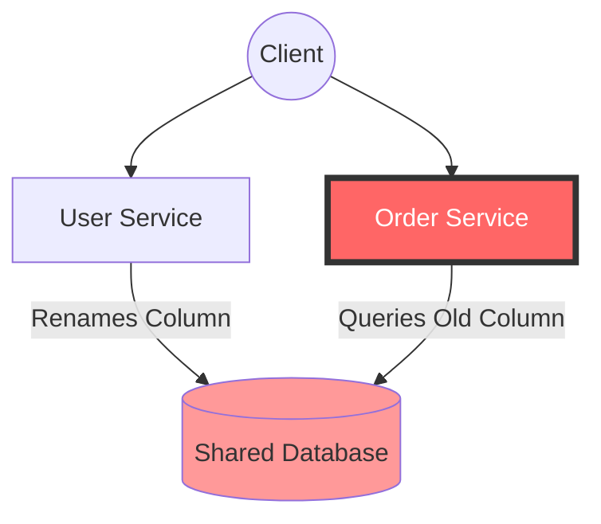
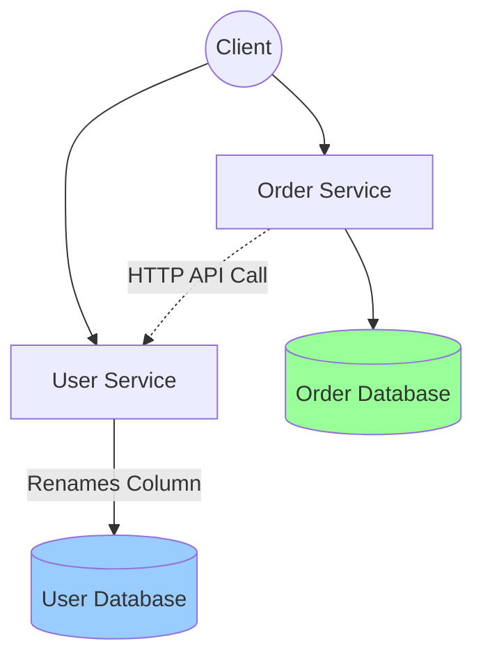

# Architecture Diagrams

## Problem Architecture (Shared Database)

*Because the database is shared, the User Service broke the Order Service.*

## Solution Architecture (Database-per-Service)

*The databases are isolated. The Order Service communicates with the User Service via a stable HTTP API, completely unaware of internal database changes.*
