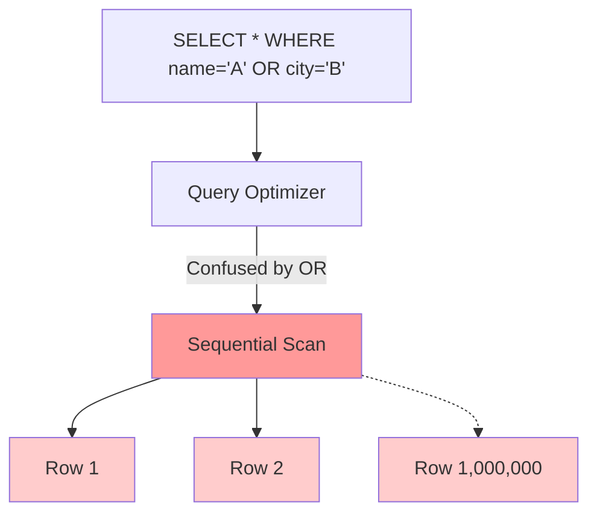
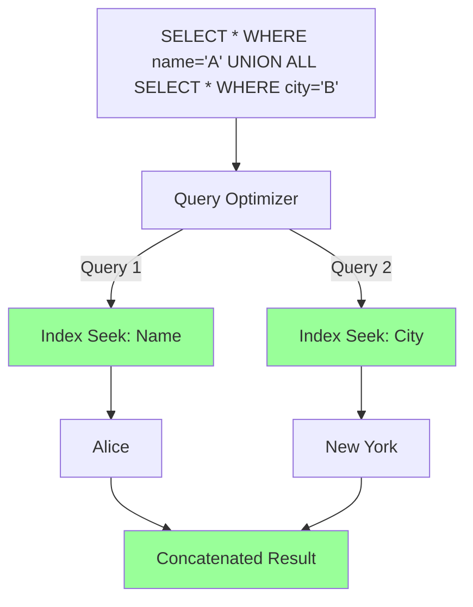

# Architecture Diagrams

## Problem Architecture (The OR Scan)

*The optimizer abandons the indexes and forces the CPU to evaluate the boolean condition on every single row in the table.*

## Solution Architecture (The UNION Rewrite)

*By splitting the query, the optimizer leverages the B-Tree indexes to instantly jump to the requested data.*
