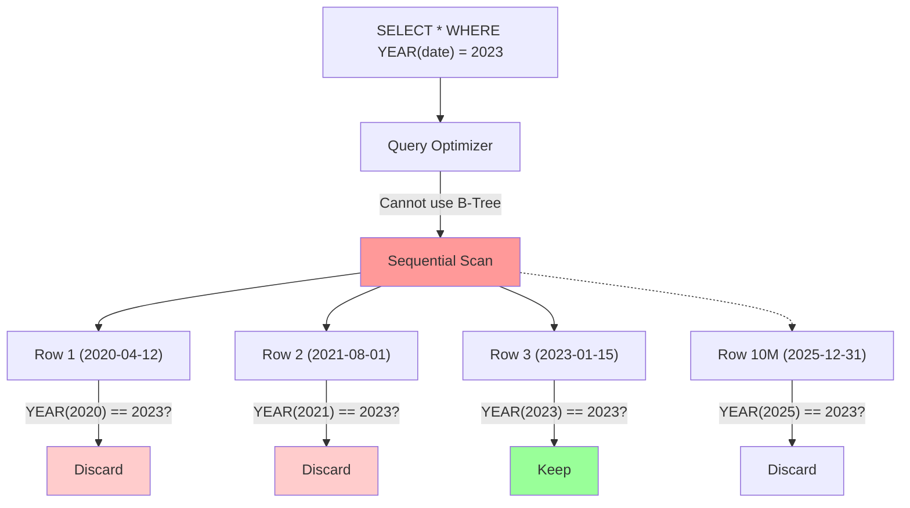

# Architecture Diagrams

## Problem Architecture (Non-SARGable Full Scan)


*The database executes the function 10 million times just to find a handful of matching rows.*

## Solution Architecture (SARGable Index Seek)

```mermaid
graph TD
    Query["SELECT * WHERE date >= '2023-01-01' AND date < '2024-01-01'"] --> Opt[Query Optimizer]
    
    Opt --> |Can use B-Tree| Seek[Index Seek (Binary Search)]
    
    Seek --> |Jump directly to| R3["Row 3 (2023-01-15)"]
    
    R3 --> |Scan next node| R4["Row 4 (2023-06-12)"]
    R4 --> |Scan next node| R5["Row 5 (2024-02-01)"]
    R5 -.-> |Stop Condition Met!| End[Return Results]
    
    style Seek fill:#99ff99
    style R3 fill:#99ff99
    style R4 fill:#99ff99
```
*The database jumps directly to the requested data and stops reading the moment it falls out of range.*
