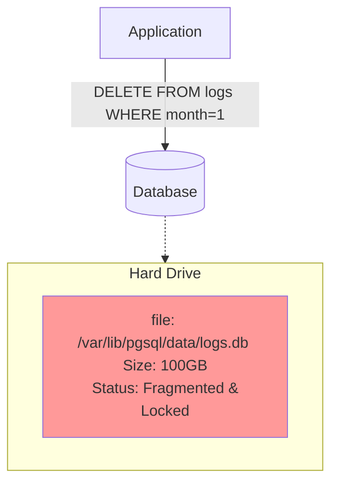
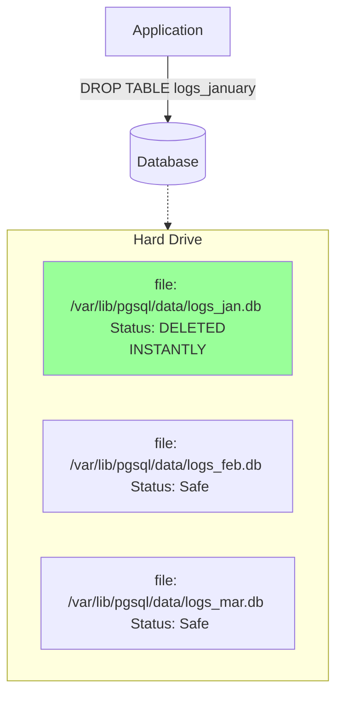

# Architecture Diagrams

## Problem Architecture (Monolithic File)

*The database has to open the massive 100GB file, scan every byte, delete specific bytes, and shift data around. This is incredibly slow.*

## Solution Architecture (Table Partitioning)

*The application still queries a logical "logs" table, but the DB Maps it to specific files. Deleting old data just means telling the OS to delete a file.*
