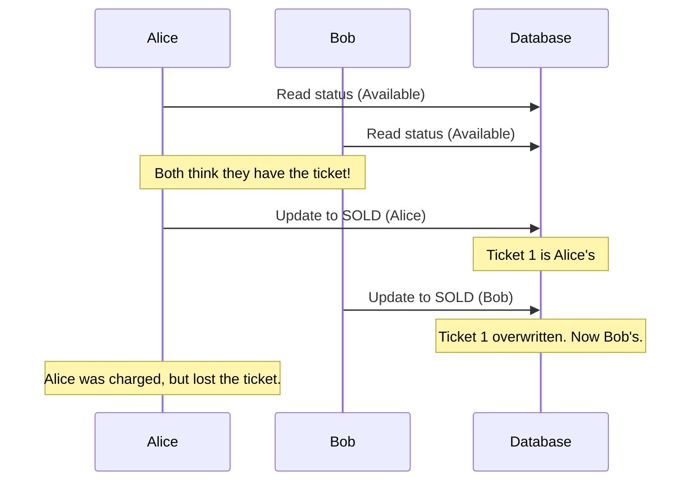
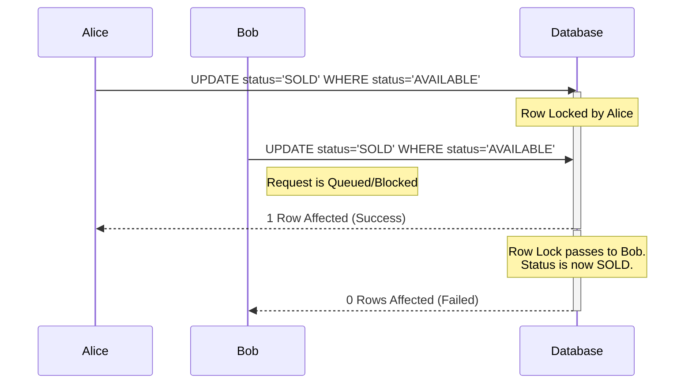

# Architecture Diagrams

## Problem Architecture (Race Condition)

```mermaid
sequenceDiagram
    participant Alice
    participant Bob
    participant DB as Database
    
    Alice->>DB: Read status (Available)
    Bob->>DB: Read status (Available)
    
    Note over Alice, Bob: Both think they have the ticket!
    
    Alice->>DB: Update to SOLD (Alice)
    Note over DB: Ticket 1 is Alice's
    
    Bob->>DB: Update to SOLD (Bob)
    Note over DB: Ticket 1 overwritten. Now Bob's.
    
    Note over Alice: Alice was charged, but lost the ticket.
```

## Solution Architecture (Claims Pattern)

```mermaid
sequenceDiagram
    participant Alice
    participant Bob
    participant DB as Database
    
    Alice->>DB: UPDATE status='SOLD' WHERE status='AVAILABLE'
    activate DB
    Note over DB: Row Locked by Alice
    
    Bob->>DB: UPDATE status='SOLD' WHERE status='AVAILABLE'
    Note right of Bob: Request is Queued/Blocked
    
    DB-->>Alice: 1 Row Affected (Success)
    deactivate DB
    
    activate DB
    Note over DB: Row Lock passes to Bob. <br/> Status is now SOLD.
    DB-->>Bob: 0 Rows Affected (Failed)
    deactivate DB
```
