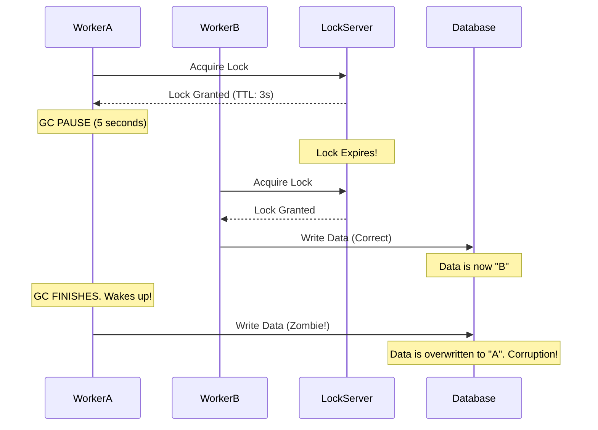
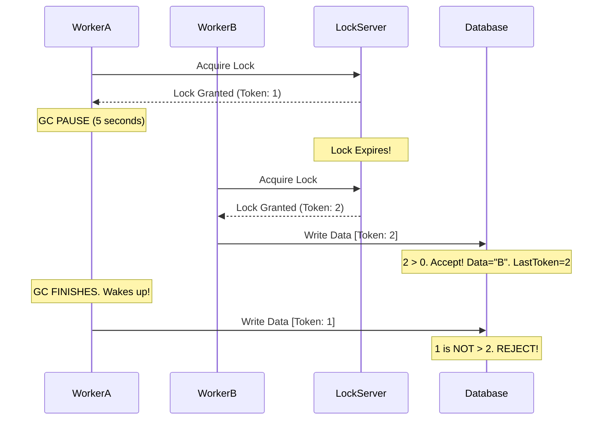

# Architecture Diagrams

## Problem Architecture (The Zombie Lock)

```mermaid
sequenceDiagram
    participant WorkerA
    participant WorkerB
    participant LockServer
    participant Database
    
    WorkerA->>LockServer: Acquire Lock
    LockServer-->>WorkerA: Lock Granted (TTL: 3s)
    
    Note over WorkerA: GC PAUSE (5 seconds)
    Note over LockServer: Lock Expires!
    
    WorkerB->>LockServer: Acquire Lock
    LockServer-->>WorkerB: Lock Granted
    
    WorkerB->>Database: Write Data (Correct)
    Note over Database: Data is now "B"
    
    Note over WorkerA: GC FINISHES. Wakes up!
    WorkerA->>Database: Write Data (Zombie!)
    Note over Database: Data is overwritten to "A". Corruption!
```

## Solution Architecture (Fencing Tokens)

```mermaid
sequenceDiagram
    participant WorkerA
    participant WorkerB
    participant LockServer
    participant Database
    
    WorkerA->>LockServer: Acquire Lock
    LockServer-->>WorkerA: Lock Granted (Token: 1)
    
    Note over WorkerA: GC PAUSE (5 seconds)
    Note over LockServer: Lock Expires!
    
    WorkerB->>LockServer: Acquire Lock
    LockServer-->>WorkerB: Lock Granted (Token: 2)
    
    WorkerB->>Database: Write Data [Token: 2]
    Note over Database: 2 > 0. Accept! Data="B". LastToken=2
    
    Note over WorkerA: GC FINISHES. Wakes up!
    WorkerA->>Database: Write Data [Token: 1]
    Note over Database: 1 is NOT > 2. REJECT!
```
