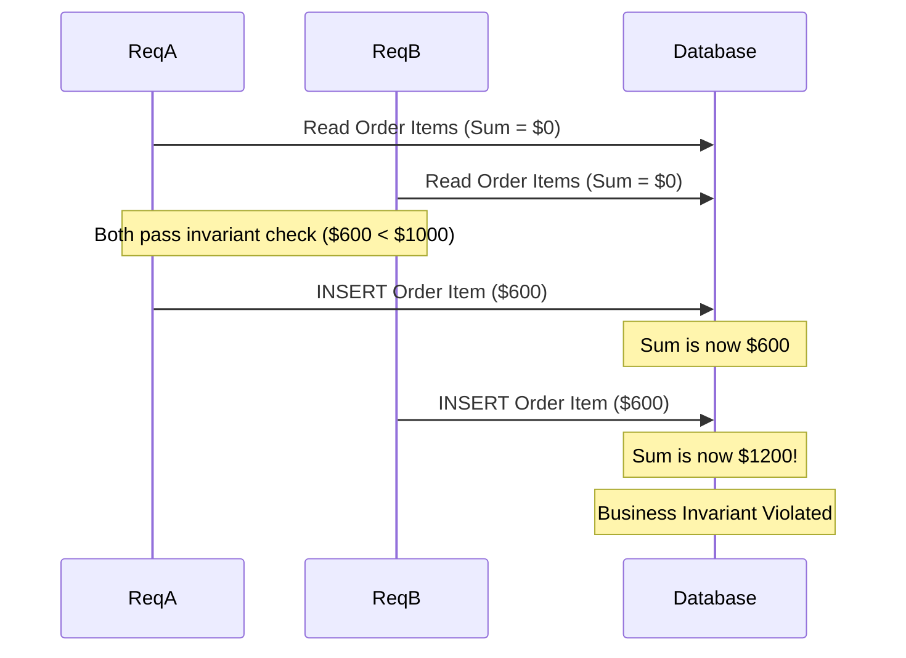
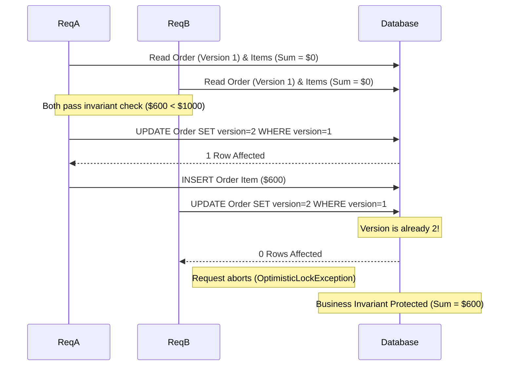

# Architecture Diagrams

## Problem Architecture (Phantom Inserts)

```mermaid
sequenceDiagram
    participant ReqA
    participant ReqB
    participant DB as Database
    
    ReqA->>DB: Read Order Items (Sum = $0)
    ReqB->>DB: Read Order Items (Sum = $0)
    
    Note over ReqA, ReqB: Both pass invariant check ($600 < $1000)
    
    ReqA->>DB: INSERT Order Item ($600)
    Note over DB: Sum is now $600
    
    ReqB->>DB: INSERT Order Item ($600)
    Note over DB: Sum is now $1200!
    
    Note over DB: Business Invariant Violated
```

## Solution Architecture (Aggregate Locking)

```mermaid
sequenceDiagram
    participant ReqA
    participant ReqB
    participant DB as Database
    
    ReqA->>DB: Read Order (Version 1) & Items (Sum = $0)
    ReqB->>DB: Read Order (Version 1) & Items (Sum = $0)
    
    Note over ReqA, ReqB: Both pass invariant check ($600 < $1000)
    
    ReqA->>DB: UPDATE Order SET version=2 WHERE version=1
    DB-->>ReqA: 1 Row Affected
    ReqA->>DB: INSERT Order Item ($600)
    
    ReqB->>DB: UPDATE Order SET version=2 WHERE version=1
    Note over DB: Version is already 2!
    DB-->>ReqB: 0 Rows Affected
    Note right of ReqB: Request aborts (OptimisticLockException)
    
    Note over DB: Business Invariant Protected (Sum = $600)
```
