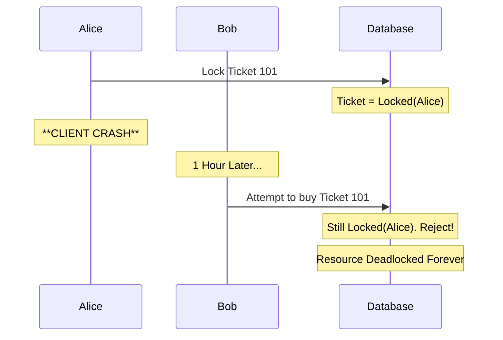
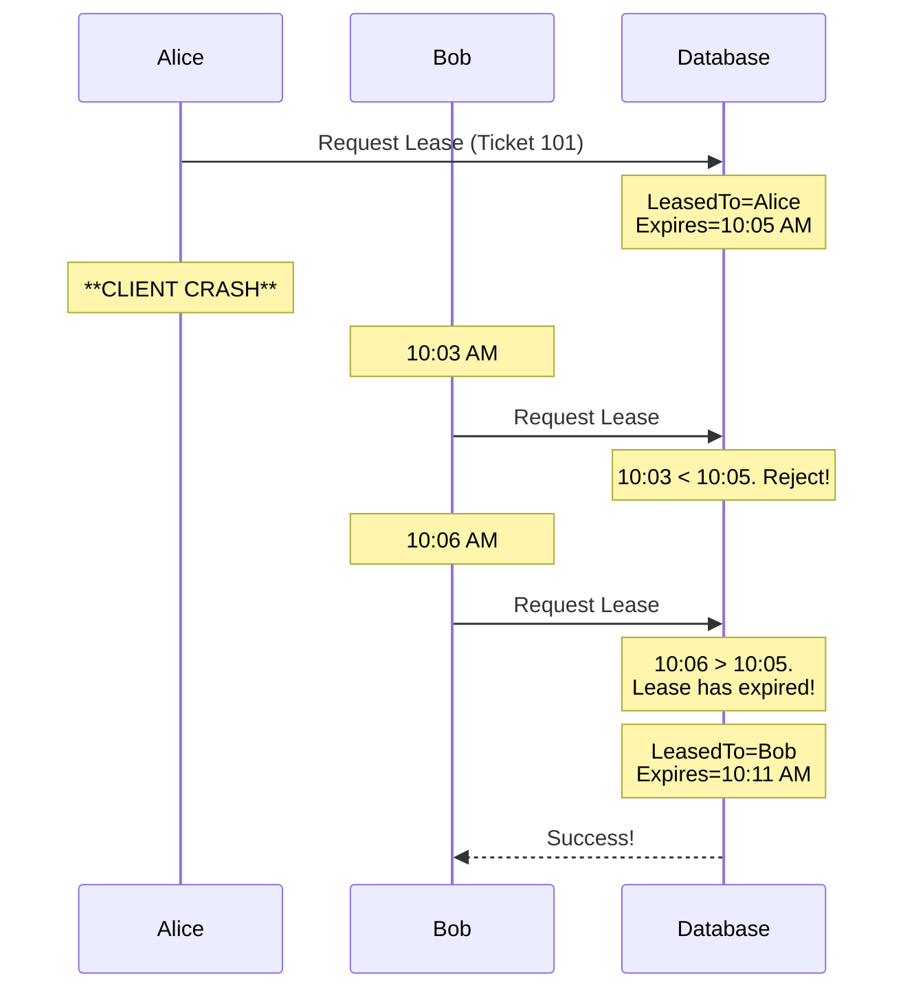

# Architecture Diagrams

## Problem Architecture (Hard Lock Starvation)

```mermaid
sequenceDiagram
    participant Alice
    participant Bob
    participant DB as Database
    
    Alice->>DB: Lock Ticket 101
    Note over DB: Ticket = Locked(Alice)
    
    Note over Alice: **CLIENT CRASH**
    
    Note over Bob: 1 Hour Later...
    Bob->>DB: Attempt to buy Ticket 101
    Note over DB: Still Locked(Alice). Reject!
    
    Note over DB: Resource Deadlocked Forever
```

## Solution Architecture (Time-Bound Lease)

```mermaid
sequenceDiagram
    participant Alice
    participant Bob
    participant DB as Database
    
    Alice->>DB: Request Lease (Ticket 101)
    Note over DB: LeasedTo=Alice <br/> Expires=10:05 AM
    
    Note over Alice: **CLIENT CRASH**
    
    Note over Bob: 10:03 AM
    Bob->>DB: Request Lease
    Note over DB: 10:03 < 10:05. Reject!
    
    Note over Bob: 10:06 AM
    Bob->>DB: Request Lease
    Note over DB: 10:06 > 10:05. <br/> Lease has expired!
    Note over DB: LeasedTo=Bob <br/> Expires=10:11 AM
    DB-->>Bob: Success!
```
