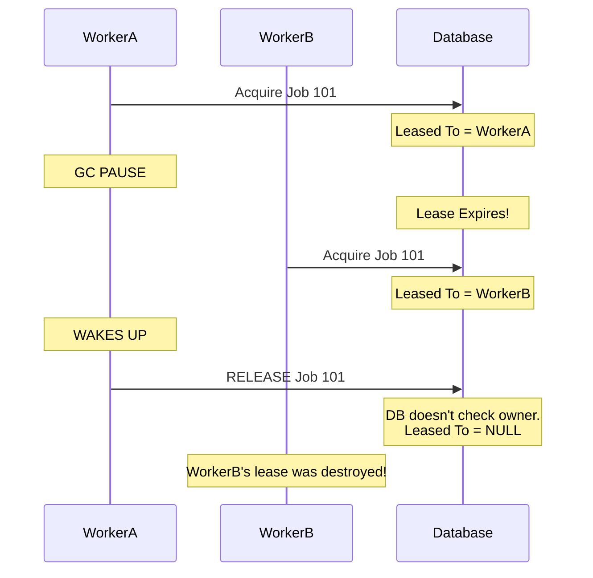
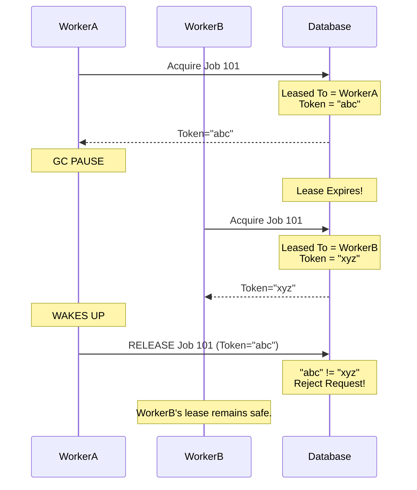

# Architecture Diagrams

## Problem Architecture (The Rogue Release)

```mermaid
sequenceDiagram
    participant WorkerA
    participant WorkerB
    participant DB as Database
    
    WorkerA->>DB: Acquire Job 101
    Note over DB: Leased To = WorkerA
    
    Note over WorkerA: GC PAUSE
    Note over DB: Lease Expires!
    
    WorkerB->>DB: Acquire Job 101
    Note over DB: Leased To = WorkerB
    
    Note over WorkerA: WAKES UP
    WorkerA->>DB: RELEASE Job 101
    Note over DB: DB doesn't check owner. <br/> Leased To = NULL
    
    Note over WorkerB: WorkerB's lease was destroyed!
```

## Solution Architecture (Ownership Tokens)

```mermaid
sequenceDiagram
    participant WorkerA
    participant WorkerB
    participant DB as Database
    
    WorkerA->>DB: Acquire Job 101
    Note over DB: Leased To = WorkerA <br/> Token = "abc"
    DB-->>WorkerA: Token="abc"
    
    Note over WorkerA: GC PAUSE
    Note over DB: Lease Expires!
    
    WorkerB->>DB: Acquire Job 101
    Note over DB: Leased To = WorkerB <br/> Token = "xyz"
    DB-->>WorkerB: Token="xyz"
    
    Note over WorkerA: WAKES UP
    WorkerA->>DB: RELEASE Job 101 (Token="abc")
    Note over DB: "abc" != "xyz" <br/> Reject Request!
    
    Note over WorkerB: WorkerB's lease remains safe.
```
