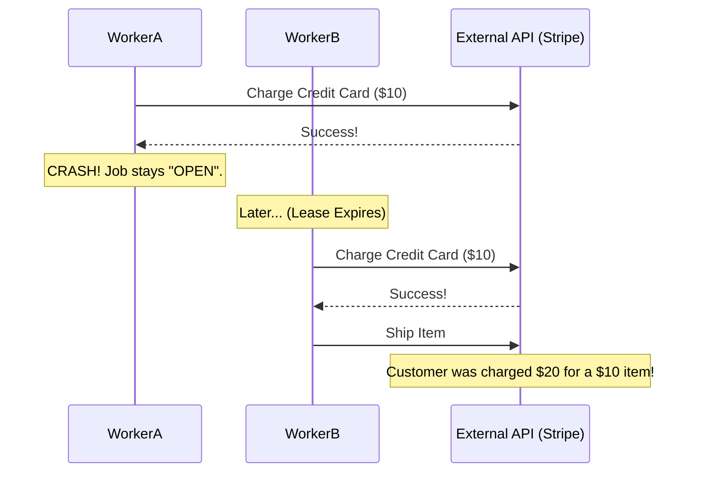
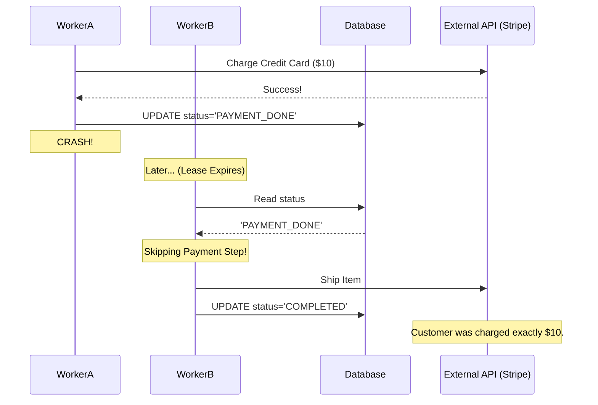

# Architecture Diagrams

## Problem Architecture (Double Execution)

```mermaid
sequenceDiagram
    participant WorkerA
    participant WorkerB
    participant API as External API (Stripe)
    
    WorkerA->>API: Charge Credit Card ($10)
    API-->>WorkerA: Success!
    
    Note over WorkerA: CRASH! Job stays "OPEN".
    
    Note over WorkerB: Later... (Lease Expires)
    
    WorkerB->>API: Charge Credit Card ($10)
    API-->>WorkerB: Success!
    WorkerB->>API: Ship Item
    
    Note over API: Customer was charged $20 for a $10 item!
```

## Solution Architecture (Checkpoints)

```mermaid
sequenceDiagram
    participant WorkerA
    participant WorkerB
    participant DB as Database
    participant API as External API (Stripe)
    
    WorkerA->>API: Charge Credit Card ($10)
    API-->>WorkerA: Success!
    WorkerA->>DB: UPDATE status='PAYMENT_DONE'
    
    Note over WorkerA: CRASH!
    
    Note over WorkerB: Later... (Lease Expires)
    
    WorkerB->>DB: Read status
    DB-->>WorkerB: 'PAYMENT_DONE'
    
    Note over WorkerB: Skipping Payment Step!
    
    WorkerB->>API: Ship Item
    WorkerB->>DB: UPDATE status='COMPLETED'
    
    Note over API: Customer was charged exactly $10.
```
